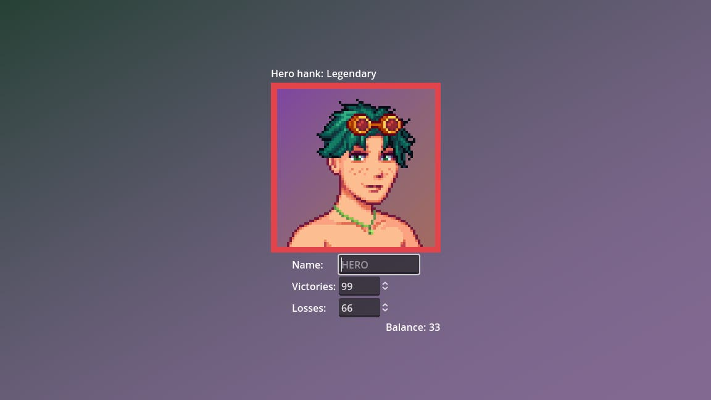

<h1>
    
    
2️⃣ Calculadora de partidas Rankeadas

</h1>

Desafio do curso de Desenvolvimento de Jogos da plataforma DIO.me.

Implementação no [motor de jogos Godot](https://godotengine.org/). Experimente na [página do Itch.io](https://gersonfedutra.itch.io/hero-hank-calculator).

**O Que deve ser utilizado**

- Variáveis
- Operadores
- Laços de repetição
- Estruturas de decisões
- Funções

## Objetivo:

Crie uma função que recebe como parâmetro a quantidade de vitórias e derrotas
de um jogador, depois disso retorne o resultado para uma variável, o saldo de
Rankeadas deve ser feito através do calculo (vitórias - derrotas).

- Se vitórias for menor do que 10 = Ferro
- Se vitórias for entre 11 e 20 = Bronze
- Se vitórias for entre 21 e 50 = Prata
- Se vitórias for entre 51 e 80 = Ouro
- Se vitórias for entre 81 e 90 = Diamante
- Se vitórias for entre 91 e 100= Lendário
- Se vitórias for maior ou igual a 101 = Imortal

## Saída

Ao final deve se exibir uma mensagem:
"O Herói tem de saldo de **{saldoVitorias}** está no nível de **{nivel}**"

## Créditos

Sprite criado na ferramenta [Stardew Valley Character Creator](https://jazzybee.itch.io/sdvcharactercreator).
Todo o resto, feito por mim.
